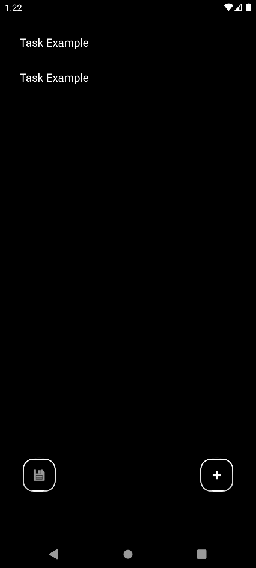
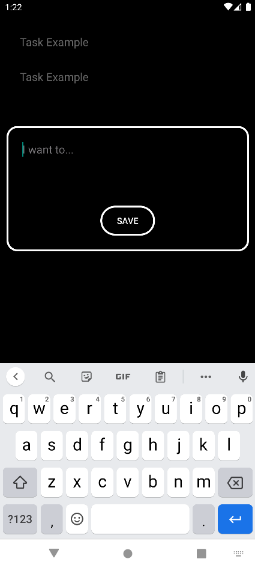

# Clean To-Do

This is a simple and clean way to help anyone keep track of what they need/want to do!

You can: Add, Remove, and Edit tasks.

IMPORTANT

**Tasks are saved when Added or Edited, but not when Removed. So be sure to save after removing a task!**

  
  

   