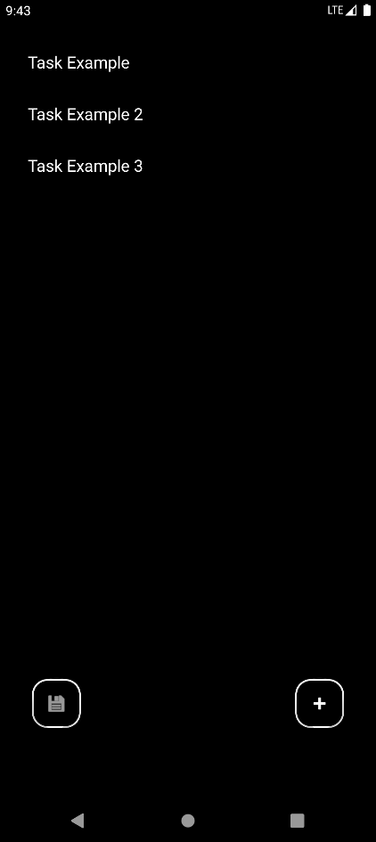
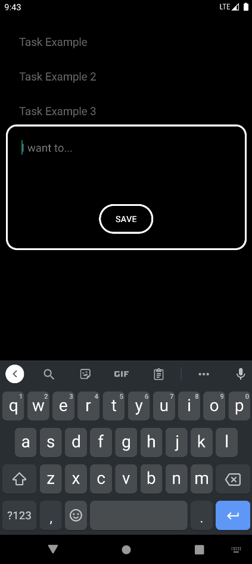
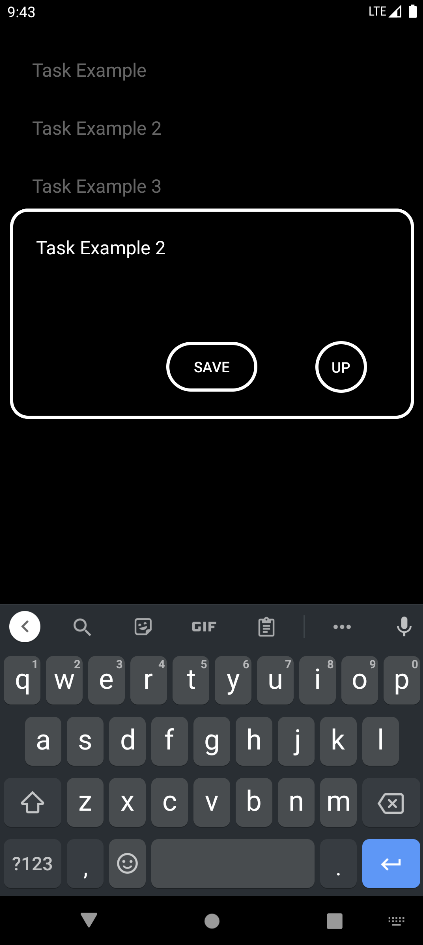

# Clean To-Do

This is a simple and clean way to help anyone keep track of what they need/want to do!

You can:

- Add Tasks.

- Remove Tasks.

- Edit Tasks.

- Bring tasks to the top.

**IMPORTANT**

**Tasks are saved when Added or Edited, but not when Removed or brought to the top. So be sure to save after removing or bringing a task to the top!**

  
  
  

